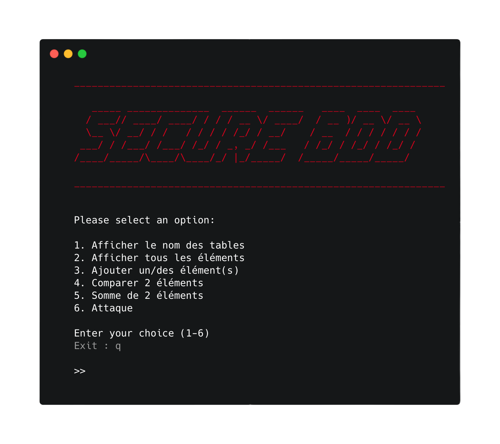

# Description du POC  
<p align="center">
 
</p>
Ce projet permet de faire du chiffrement homomorphe. Il a été fait dans le cadre de mes études à l'ENSIBS. Dans ce POC, nous allons tester l'order preserving et l'addition. Nous finirons par faire une attaque statistique sur l'order preserving. 
  
Afin de donner un contexte à ce POC, nous dirons que les informations mises dans la base seront des salaires de différentes personnes.

Sinon, le chiffrement homomorphique est une technique permettant d’effectuer des traitements sur des données chiffrées sans qu’elles soient exposées en clair. L’ordre preserving est une méthode de chiffrement qui permet de conserver l’ordre des données chiffrées.


# Dependences
Pour que ce POC puisse fonctionner, il faut que le port spécifié dans le fichier de configuration `config.json` soit disponible (base: 5000). C'est grâce à ce port que le client et le serveur vont pouvoir communiquer.

Dans un deuxième temps, il faut que python3 soit installé sur la machine. Pour le développement, nous avons utilisé `Python 3.10.8` sur un macOS 13.1 et `Debian GNU/Linux 11 (bullseye)`

Pour finir, si votre machine possède internet, les dépendances peuvent être installées en faisant :
```shell
pip3 install -r requirements.txt
```
Il faudra par la suite enlever la ligne : `sys.path.append('libs')` dans les différents fichiers.   
Cependant, si votre machine ne possède pas internet, les librairies sont deja installé dans le dossier libs. 

# Architecture
Notre projet est architecturé comme l'illustre cet arbre:
```md
BDD_HOMOMORPHIQUE/
├── Config/
│   ├── .env
│   └── config.json
├── libs/
│   └── les librairies
├── preparation_attaque/
│   ├── src/
│   │   └── person.txt
│   ├── construction_bdd.py
│   └── script_add_in_bdd.py
├── serveur/
│   ├── connect_bdd.py
│   └── serveur.py
├── main.py 
├── database.db
├── README.md
└── requirements.txt
```

## Partie Config
Le fichier `.env` permet de mettre ses clefs permettant le bon chiffrement/déchiffrement des données. 

Le fichier `config.json` permet de spécifier différentes informations comme le nom de la base de données. Voici un exemple de fichier:
```json
{
    "PORT_SOCKET":5019,
    "NAME_DATABASE":"rajon.db",
    "NAME_TABLE":"test_final16",
    "VERBOSE": false,

    "ATTACK_NB":200

}
```

## Partie libs
Le dossier libs contient toutes les librairies nécessaires pour que ce POC s'exécute correctement. Il n'est pas nécessaire de le modifier.

## Partie client
Le dossier client contient uniquement un fichier nommé `chiffrement.py`. Ce fichier permet de chiffrer/déchiffrer les données avant et après avoir envoyé des données au serveur distant. Voici un schéma illustrant le fonctionnement:

$$Schema$$

Le fichier `main.py`, même s'il n'est pas dans le répertoire client, fait partie du client. Il permet à l'utilisateur d'afficher les personnes dans sa base de données, d'afficher les salaires, de comparer différents salaires, de faire la somme ainsi que de faire une attaque dessus. 

## Partie serveur
Le dossier serveur contient quand à lui plusieurs fichiers:  
  
connect_bdd contenant différentes fonctions permettant de faire différentes requètes sur la base de données.

Le fichier serveur.py qui est toujours en écoute afin de recevoir les données envoyées par le client (main.py) et les traiter.

## Partie preparation_attaque
Ce dossier permet, comme son nom l'indique de préparer la partie d'attaque. Car, comme l'attaque se base sur des statistiques, il faut qu'il y ait plusieurs données dans la base. Pour cela, nous avons fait le script `construction_bdd.py` permettant de faire des call API sur https://randomuser.me/api/. A chaque nom, nous lui avons attribué un salaire avec une certaine pondération. Pour plus d'information, lire le PDF. 

Après avoir extrait ces noms, nous les avons ajouter à la base de données grâce au fichier: `construction_bdd.py`. Le nombre de données intégrés dans la base peuvent être changés en modifiant la variable `ATTACK_NB` du fichier config.json (de base: 200 | Max 5000).

# Utilisation
Pour utiliser le POC, il faut exécuter dans un premier temps le fichier `server.py` en étant à la base du projet:
```shell
python3 serveur/serveur.py
```
Quand ce programme tourne, nous pouvons exécuter le fichier `main.py``
```shell
python3 main.py
```

Il faut simplement suivre le menu pour faire les différentes actions. 

Avant de faire l'attaque, exécuter le fichier preparation_attaque/script_add_in_bdd.py afin de remplir la base de données.

Normalement tout devrait marcher 🙃
<p align="center">
 
</p>
<br>
<br> 

# Amélioration
Correction d'erreurs

